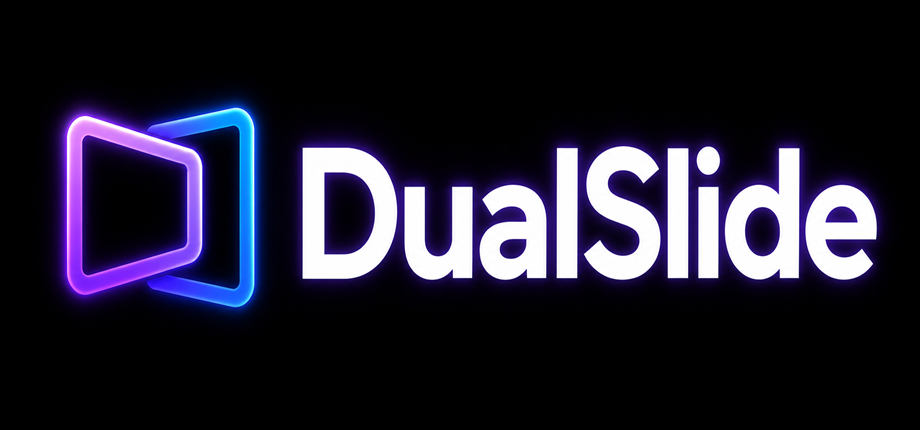
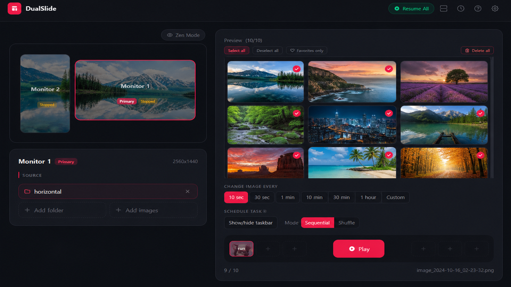
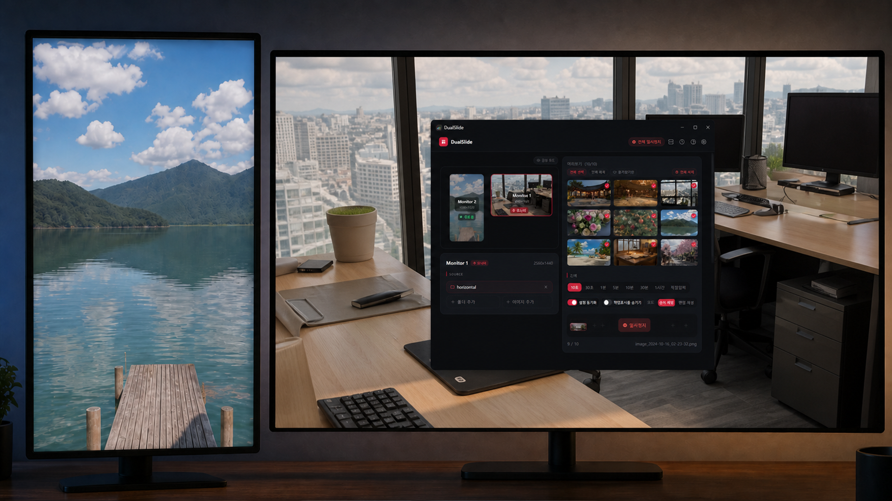

# DualSlide 🖥️

> **각 모니터마다 독립적인 슬라이드쇼 배경화면.**  
> 폴더, 스케줄, 즐겨찾기, 단축키까지 — 멀티모니터 유저를 위한 Windows 배경화면 관리 앱.

[](https://store.steampowered.com/app/4631820/DualSlide/)
[](https://store.steampowered.com/app/4631820/DualSlide/)
[](https://tauri.app)
[](https://store.steampowered.com/app/4631820/DualSlide/)

<br>

## 📱 스크린샷



| 대시보드 | 멀티모니터 환경 |
|:---:|:---:|
|  |  |

<br>

## 🚀 핵심 기능

### 🗂️ 슬라이드쇼 & 이미지 관리
- **모니터별 독립 슬라이드쇼** — 각 디스플레이에 서로 다른 폴더·이미지 소스를 할당, 완전히 독립 운영
- **멀티 소스** — 여러 폴더와 개별 이미지를 혼합해 하나의 소스 풀로 구성
- **즐겨찾기** — 마음에 드는 이미지를 즐겨찾기 등록, 셔플 시 3배 가중치로 자주 등장
- **핀(Pin)** — 현재 이미지를 고정해 슬라이드쇼가 넘어가지 않도록 잠금
- **지원 포맷** — JPG / JPEG / PNG / BMP / WEBP

### ⏱️ 자동화 & 스케줄
- **시간대 스케줄** — 하루를 최대 6슬롯으로 나눠 시간대별 이미지 소스 자동 전환 (출근 시간엔 풍경, 밤엔 야경)
- **전체화면 자동 일시정지** — 게임·영상 플레이어 실행 시 자동 멈춤, 종료 후 재개

### 🎨 디스플레이 제어
- **모니터 동기화** — 모든 모니터의 다음/이전 이미지를 한 번에 전환
- **젠 모드(Zen Mode)** — 단축키 한 번으로 작업표시줄 + 바탕화면 아이콘 전부 숨김, 배경화면만 남겨 몰입 감상
- **태스크바 제어** — 모니터별로 작업표시줄 표시/숨김을 독립적으로 설정
- **크로스페이드 전환** — DWM 기반 부드러운 이미지 페이드 처리

### ⌨️ 시스템 통합
- **글로벌 핫키** — 어떤 앱이 포커스여도 이전/다음/일시정지 제어
- **프로필** — 전체 모니터 구성을 프로필로 저장, 한 번에 전환
- **시스템 트레이 상주** — 백그라운드에서 조용히 동작, 트레이 아이콘으로 빠른 접근
- **부팅 시 자동 실행** — Windows 시작과 함께 슬라이드쇼 자동 재개
- **8개 언어** — 영어, 한국어, 일본어, 중국어, 독일어, 스페인어, 프랑스어, 이탈리아어

<br>

## 🛠 기술 스택

| 영역 | 기술 |
|------|------|
| 앱 프레임워크 | Tauri 2.0 |
| 프론트엔드 | React 18 + TypeScript + Vite |
| 백엔드 | Rust + Tokio (비동기) |
| UI 스타일 | Tailwind CSS + framer-motion |
| 배경화면 엔진 | more-wallpapers (크로스플랫폼) |
| 설정 저장 | tauri-plugin-store (JSON) |
| 글로벌 핫키 | tauri-plugin-global-shortcut |
| 자동 실행 | tauri-plugin-autostart |
| 다국어 | i18next + react-i18next |
| 이미지 검증 | image crate |
| 셔플 | rand crate |

<br>

## 🏗 프로젝트 구조

```
src/
├── components/
│   ├── MonitorCard.tsx      # 모니터별 설정 카드
│   ├── MonitorLayout.tsx    # 모니터 시각적 배치도
│   ├── Settings.tsx         # 전체 설정 모달
│   ├── HotkeyInput.tsx      # 핫키 녹화 입력
│   └── ProUpgradeModal.tsx  # 업그레이드 모달
├── hooks/
│   ├── useMonitors.ts       # 모니터 목록
│   ├── useSlideshow.ts      # 슬라이드쇼 상태
│   └── useHotkeys.ts        # 핫키 관리
├── locales/                 # en / ko / ja / zh / de / es / fr / it
├── lib/
│   ├── commands.ts          # Tauri 커맨드 래퍼
│   └── i18n.ts              # i18next 초기화
└── App.tsx

src-tauri/src/
├── main.rs                  # 앱 엔트리
├── commands.rs              # Tauri 커맨드
├── slideshow.rs             # 슬라이드쇼 엔진
├── monitor.rs               # 모니터 감지 + 배경 설정
├── hotkey.rs                # 글로벌 핫키
├── window_mover.rs          # 창 모니터 간 이동
└── profiles.rs              # 프로필 관리
```

<br>

## ⚡ 주요 구현 포인트

### 1. 모니터별 독립 슬라이드쇼 엔진

각 모니터는 독립적인 `SlideshowEngine` 인스턴스를 가지며, `Arc<Mutex<>>` 로 스레드 안전하게 관리됩니다.  
이미지는 경로만 저장하고 메모리에 로드하지 않아 RAM 점유를 최소화합니다.

```rust
// slideshow.rs
pub struct SlideshowEngine {
    monitors: HashMap<String, MonitorSlideshow>,
    // 이미지 경로만 보관, 메모리 로드 없음
}
```

### 2. 프로필 전환 레이스컨디션 방지

프로필 전환 시 이전 `scanImages` 작업이 남아 있으면 `CancellationToken`으로 즉시 중단하고 새 스캔을 시작합니다.

```rust
// 기존 스캔 취소 후 새 소스로 재시작
cancellation_token.cancel();
let new_token = CancellationToken::new();
spawn_scan(new_source, new_token);
```

### 3. 시간대 스케줄 자동 전환

Tokio 비동기 타이머로 분 단위 체크를 실행, 현재 시각이 스케줄 슬롯에 진입하면 이미지 소스를 자동 교체합니다.

```
[0시 ~ 7시]  → 야경 폴더
[7시 ~ 12시] → 풍경 폴더
[12시 ~ 18시] → 도시 폴더
[18시 ~ 24시] → 노을 폴더
```

### 4. 전체화면 자동 감지

Windows API로 포그라운드 윈도우의 전체화면 여부를 주기적으로 폴링,  
게임·영상 플레이어 진입 시 슬라이드쇼를 자동 일시정지하고 종료 후 재개합니다.

<br>

## 🔧 로컬 실행

```bash
# 의존성 설치
npm install

# 개발 서버 실행
npx tauri dev

# 프로덕션 빌드
npx tauri build
# → src-tauri/target/release/bundle/nsis/DualSlide_x.x.x_x64-setup.exe
```

**요구사항**
- Node.js 18+
- Rust (stable)
- Windows 10/11 64-bit

<br>

## 📋 개발 이력

| 날짜 | 내용 |
|------|------|
| 2026-06 | Steam 출시, 아이콘 업데이트, 드래그앤드롭 개선 |
| 2026-04 | 시간대 스케줄 + 멀티 소스 구현 |
| 2026-03 | 즐겨찾기 & 핀 기능 구현 |
| 2026-03 | 젠 모드 추가 (단축키 몰입 감상) |
| 2026-03 | 모니터 동기화, 태스크바 제어 |
| 2026-03 | Pro 티어 제거, 전 기능 무료 개방 |
| 2026-03 | 초기 구현 — 멀티모니터 슬라이드쇼 엔진 |

<br>

## 📎 링크

| | |
|---|---|
| Steam 스토어 | https://store.steampowered.com/app/4631820/DualSlide/ |
| GitHub | https://github.com/damjel46/DualSlides |

---

Built with [Tauri](https://tauri.app) — Electron이 아니라서 가볍고 RAM을 잡아먹지 않습니다.
